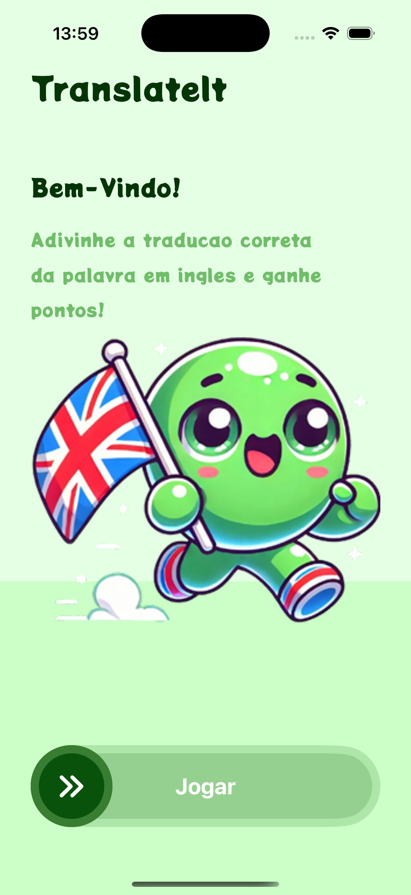
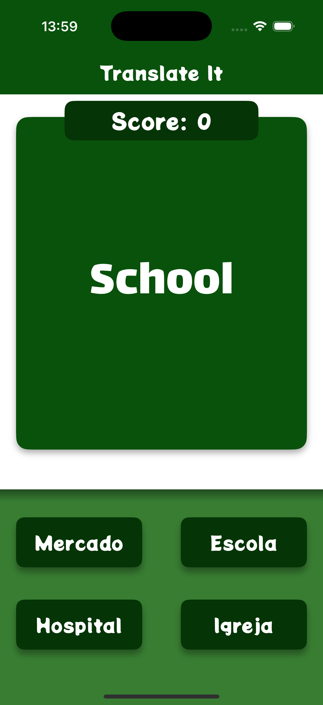
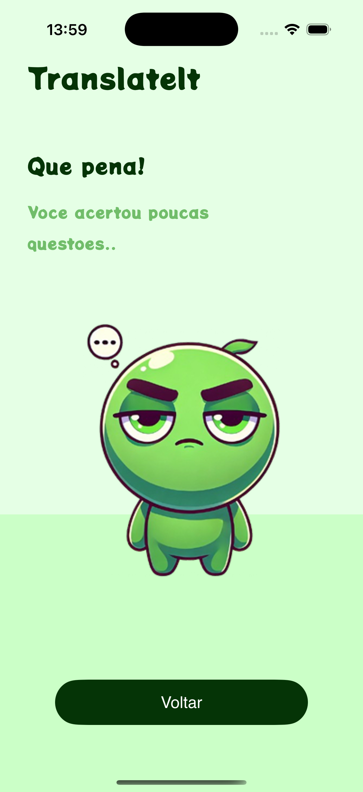
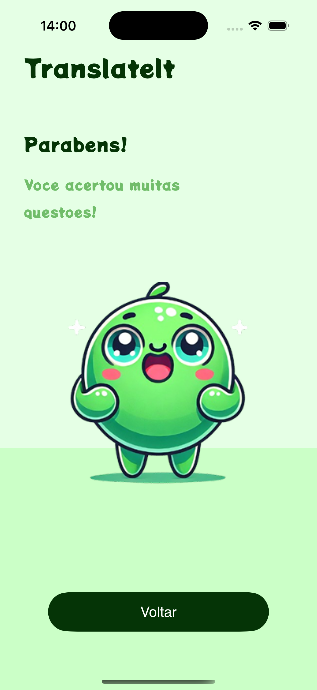

# TranslateIt

**TranslateIt** is an app I developed to make learning English fun and interactive. The app displays a word in English at the center of the screen and four options in Portuguese. The goal is to guess the correct translation to earn points. With well-defined screens and visual feedback (like congratulatory or motivational messages), the app offers a friendly and engaging experience for anyone looking to practice vocabulary.

---

## Screenshots

### Welcome Screen

### Gameplay Screen

### Game Over - Improve

### Game Over - Congratulations

---

